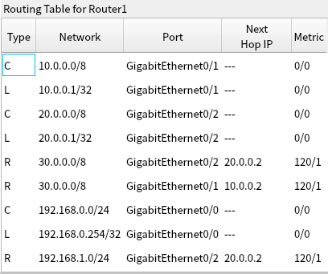

# 从 PocketTracer 看网络通信原理


## 附录

### 基本概念

+ PDU

  Protocol Data Unit，协议数据单元，指的是在不同网络层次间传递的数据单位，每个层次都会根据自己的协议来定义PDU的格式和用途。

+ LAN

  Local Area Network，局域网。

+ VLAN：

  Virtual Local Area Network，虚拟局域网。

+ 集线器

  Hub,  工作在物理层的设备，集线器接收到一个网络设备发送的信号时，它会重新复制这个信号，然后广播到所有其他端口。这意味着集线器并不识别或处理数据帧中的地址信息，它简单地将所有接收到的数据帧转发到除了源端口之外的所有其他端口。

  集线器是半双工通信设备，即可以双向传输数据但是同一时间只能发送或接收数据。

+ 交换机

  Switch，工作在数据链路层（第二层）。

  + 实现MAC地址和硬件端口（比如 Ethernet0/1）的映射，即根据数据包中的MAC地址信息，决定将数据包转发到哪个端口；
  + 实现 VLAN，分割大的广播域，提升网络带宽利用率，各子VLAN是不同的网段；TODO?
  + 拓展局域网设备数量，比如 2950-24 只有24个Ethernet端口，最多支持24台机器，但是可以通过多层交换机，拓展局域网设备数量。

+ 网桥

  Bridge，工作在数据链路层（第二层），主要用于连接两个或多个局域网（LAN）段。

+ 中继器

  Repeater，工作在物理层（第一层），其主要功能是扩展网络的距离和增强信号，补偿信号在传输介质（如双绞线或光纤）中因距离增加而产生的信号衰减。

+ 碰撞域与广播域

  碰撞域，Collision Domain（又名冲突域），指两个或多个网络设备同时尝试在同一通信媒介上发送数据时可能发生冲突的区域。在计算机和计算机通过设备互联时，会建立一条通道，如果这条通道只允许瞬间一个数据报文通过，那么在同时如果有两个或更多的数据报文想从这里通过时就会出现冲突了。

  广播域，Broadcast Domain，指一个数据帧或包被广播时能够到达的所有设备组成的区域。

  集线器既不隔离冲突域（半双工通信，两台设备通过集线器同时发送数据可能发生冲突），也不隔离广播域；
  交换机隔离冲突域（全双工通信），不隔离广播域；
  路由器既隔离冲突域，也隔离广播域。

+ 无线网络中的概念：

  + AP: Access Point，接入点，如智能手机、笔记本电脑等，可通过Wi-Fi连接到网络。

  + BSS：Basic Service Set，基本服务集，无线网络中的一个基本单元，由一个AP和所有与之通信的无线设备组成。

+ PSTN：Public Switched Telephone Network，公共交换电话网络。

+ ARP

  Address Resolution Protocol，地址解析协议，用于将网络层的IP地址映射为链路层的物理地址（即MAC地址）。

+ ICMP

+ 子网掩码

  用于区分IP地址中的网络部分和主机部分。比如 
  192.168.16.1/25，网络号是 192.168.16.0，主机号是 1；

  192.168.16.130/25，网络号是 192.168.16.128，主机号是 2。

+ 三层交换机

  是一种可以在OSI模型第三层即网络层上工作的网络设备。与二层交换机只能通过MAC地址进行数据帧交换不同，三层交换机还能根据IP地址进行数据包的转发，实现更高级别的路由功能。

  三层交换机通过学习网络中不同设备的MAC地址和IP地址，建立一个称为“MAC地址表”和“路由表”的数据结构。当接收到一个数据包时，三层交换机会先检查目标MAC地址是否在MAC地址表中，如果在，则直接将数据包转发到目标设备；如果不在，则会根据目标IP地址查询路由表，找到最佳的路径，并将数据包转发到相应的网络。

  三层交换机的端口有两种工作模式：交换、路由，当使用某个端口连接外部网络时需要将端口切换为路由模式， 使用`no switchport`。

  > 交换机可以实现同局域网内设备通信，也可以设置虚拟局域网，实现隔离；
  >
  > 不过无法实现不同局域网的通信，需要使用三层交换机或者路由器实现。

+ 动态路由协议

  + RIP

    + RIPv1

      RIPv1 是基于距离向量的，即路由规则是选择**距离最短**（准确说其实是**中间节点数最少**）的路由。

      负载均衡策略是等价负载均衡。

      RIP 协议需要手动配置（命令 `router rip`）直连网络地址 。

      会每隔30秒，向所有连接就绪状态的端口发送（即广播） RIPv1 协议报动态更新路由表，可以通过 `debug ip rip` （开启特权模式后即可执行此命令）查看详细流程。

      ```
      Router>enable
      Router#debug ip rip
      RIP protocol debugging is on
      RIP: sending  v1 update to 255.255.255.255 via GigabitEthernet0/0 (192.168.0.254)
      RIP: build update entries
            network 10.0.0.0 metric 1
            network 20.0.0.0 metric 1
            network 30.0.0.0 metric 2
            network 192.168.1.0 metric 2
      RIP: sending  v1 update to 255.255.255.255 via GigabitEthernet0/2 (20.0.0.1)
      RIP: build update entries
            network 10.0.0.0 metric 1
            network 192.168.0.0 metric 1
      RIP: sending  v1 update to 255.255.255.255 via GigabitEthernet0/1 (10.0.0.1)
      RIP: build update entries
            network 20.0.0.0 metric 1
            network 192.168.0.0 metric 1
            network 192.168.1.0 metric 2
      RIP: received v1 update from 20.0.0.2 on GigabitEthernet0/2
            30.0.0.0 in 1 hops
            192.168.1.0 in 1 hops
      RIP: received v1 update from 10.0.0.2 on GigabitEthernet0/1
            30.0.0.0 in 1 hops
            192.168.1.0 in 2 hops
      ```

      最终的路由表（拓扑图：router-protocols-ripv4.pkt）：

      

    + RIPv2

      RIPv1 是有类路由器协议，不支持变长子网掩码 VLSM，RIPv2是无类路由协议，支持VLSM。

      RIPv1 通过广播发送 RIP 更新报文， RIPv2 通过组播发送 RIP 更新报文。RIPv2的组播地址是 224.0.0.9，这个地址被所有运行 RIPv2 的路由器监听，以接收路由更新信息（内部原理暂略），以 router-protocols.pkt 的拓扑场景为例，所有路由器都启用RIPv2后，路由更新数据报就只会在路由器中间传输不会再传给PC端。

      通过在 `router rip` 页面配置 `version 2` 可以启用 RIPv2 协议。

      > 有类路由协议基于IP地址的分类，即A、B、C、D和E类地址；
      >
      > 无类路由协议在路由更新中包含子网掩码，这样它们可以支持任意长度的子网划分（Variable-Length Subnet Mask, VLSM），允许在同一个网络中使用不同大小的子网。
      >
      > 比如 192.168.16.1/25，这里的子网掩码是前面25位，即255.255.255.128。
      >
      > 组播：允许发送者将数据包发送到一组特定的接收者，而不是网络中的所有设备。只有加入组播组的设备才会接收和处理这些数据包。

  + OSPF

    OSPF 是基于链路状态的，其路由规则是选择”**路径代价最少**“的路由。

    > 思科路由器中，OSPF协议计算代价的方法：
    >
    > 代价 = 参考带宽 / 接口带宽
    >
    > 默认的参考带宽值是100Mbps。通过使用`auto-cost reference-bandwidth`命令可以修改参考带宽值。
    >
    > 接口带宽取每个跃点出接口带宽的最小值。

    负载均衡策略是等价负载均衡。

    OSPF 也是**无类路由协议**，支持变长子网掩码 VLSM。

    RIP 协议也需要手动配置（命令 `router ospf [pid]`）直连网络地址 。

    ```shell
    # 先进入特权模式
    enable
    # 进入配置终端
    configure terminal
    router ospf 100
    # 设置直连网络地址
    # area 0：指定该网络应该属于OSPF中的哪个区域。区域ID为0通常被用作OSPF骨干区域（backbone area），所有其他区域都应该通过骨干区域连接。
    network 10.0.0.0 0.0.0.3 area 0
    network 30.0.0.0 0.0.0.3 area 0
    # 清除 OSPF 协议配置
    no router ospf 100
    
    # 返回特权模式
    # 展示配置
    show running-config
    show running-config | section ospf #只展示 ospf 的配置
    # 查看 ospf 相关事件
    debug ip ospf events
    # 关闭 ospf 相关事件
    no debug ip ospf events
    # 展示路由表信息，如 router-protocols-ospf.pkt
    show ip route
    Codes: L - local, C - connected, S - static, R - RIP, M - mobile, B - BGP
           D - EIGRP, EX - EIGRP external, O - OSPF, IA - OSPF inter area
           N1 - OSPF NSSA external type 1, N2 - OSPF NSSA external type 2
           E1 - OSPF external type 1, E2 - OSPF external type 2, E - EGP
           i - IS-IS, L1 - IS-IS level-1, L2 - IS-IS level-2, ia - IS-IS inter area
           * - candidate default, U - per-user static route, o - ODR
           P - periodic downloaded static route
    
    Gateway of last resort is not set
    
         10.0.0.0/30 is subnetted, 1 subnets
    O       10.0.0.0/30 [110/67] via 50.0.0.1, 00:05:17, GigabitEthernet0/0
         20.0.0.0/30 is subnetted, 1 subnets
    O       20.0.0.0/30 [110/66] via 50.0.0.1, 00:05:17, GigabitEthernet0/0
         30.0.0.0/30 is subnetted, 1 subnets
    O       30.0.0.0/30 [110/66] via 50.0.0.1, 00:05:17, GigabitEthernet0/0
         40.0.0.0/30 is subnetted, 1 subnets
    O       40.0.0.0/30 [110/65] via 50.0.0.1, 00:05:17, GigabitEthernet0/0
         50.0.0.0/8 is variably subnetted, 2 subnets, 2 masks
    C       50.0.0.0/30 is directly connected, GigabitEthernet0/0
    L       50.0.0.2/32 is directly connected, GigabitEthernet0/0
         192.168.16.0/24 is variably subnetted, 2 subnets, 2 masks
    O       192.168.16.0/25 [110/67] via 50.0.0.1, 00:05:17, GigabitEthernet0/0
    O       192.168.16.128/26 [110/66] via 50.0.0.1, 00:05:17, GigabitEthernet0/0
    O    192.168.18.0/24 [110/2] via 50.0.0.1, 00:05:17, GigabitEthernet0/0
         192.168.20.0/24 is variably subnetted, 2 subnets, 2 masks
    C       192.168.20.0/24 is directly connected, GigabitEthernet0/1
    L       192.168.20.254/32 is directly connected, GigabitEthernet0/1
    ```

  + BGP

    Border Gateway Protocol，边界网关协议。

    BGP vs OSPF:

    - OSPF是一种内部网关协议（IGP），主要用于单个自治系统（AS）内部的路由。
    - BGP是一种外部网关协议（EGP），设计用于在不同的自治系统之间交换路由信息。
    - OSPF使用Dijkstra算法的最短路径优先（SPF）算法来计算到达目的地的最佳路径。
    - BGP使用基于路径属性的路径矢量算法来选择最佳路径，这些属性包括路径长度、路由源的可靠性、策略决策等。
    - OSPF定期发送路由更新，即使网络没有变化也会这样做。
    - BGP仅在网络拓扑发生变化时发送更新，这使得BGP在稳定状态下更高效。
    - OSPF仅携带到达目的地的路由信息。
    - BGP携带完整的路由信息，包括到达目的地的完整路径（即AS路径）。

    配置方法：

    ```shell
    # 100 是当前自治系统的编号
    router bgp 100
    # 指定邻居路由器，需要指定IP和自治系统的编号
    neighbor 10.0.0.2 remote-as 200
    network 10.0.0.0 mask 255.255.255.0
    end
    ```

  + OSPF 到 BGP 的再分发

    参考官方支持文档：[Understand the Redistribution of OSPF Routes into BGP](https://www.cisco.com/c/en/us/support/docs/ip/border-gateway-protocol-bgp/5242-bgp-ospf-redis.html)

    测试文件： router-protocols-bgp.pkt。

    核心配置：

    ```shell
    # R2
    router ospf 1
     log-adjacency-changes
     # 用于 OSPF 到 BGP的再分发
     redistribute bgp 200 subnets 
     network 172.10.0.0 0.0.0.255 area 0
    router bgp 200
     bgp log-neighbor-changes
     # 用于 BGP 到 OSPF 的再分发
     bgp redistribute-internal
     no synchronization
     neighbor 10.0.0.2 remote-as 100
     neighbor 20.0.0.2 remote-as 300
     redistribute ospf 1 
    # R3
    router ospf 2
     log-adjacency-changes
     redistribute bgp 300 subnets 
     network 172.10.1.0 0.0.0.255 area 0
    router bgp 300
     bgp log-neighbor-changes
     bgp redistribute-internal
     no synchronization
     neighbor 20.0.0.1 remote-as 200
     neighbor 30.0.0.2 remote-as 100
     redistribute ospf 2 
    ```

  + IGP EGP

    IGP（Interior Gateway Protocol，内部网关协议），适用于单一网络内部，如企业内部网络或ISP的内部网络。

    EGP（Exterior Gateway Protocol，外部网关协议），适用于跨网络的互联，如互联网服务提供商（ISP）之间的互联。

+ 高可靠网络

  + HSRP

    Hot Standby Router Protocol，热备份路由协议。允许多台路由器共同虚拟成一个路由器，对外提供一个虚拟IP地址。当主路由器出现故障时，备份路由器能够无缝接管，确保网络的连续性和可靠性。

  + MSTP


### 注意事项

+ PocketTracer 模拟的虚拟设备加入网络后也需要时间启动，网线上的两个三角符号闪绿灯表示两个设备连接成功。
+ PocketTracer 路由器、三层交换机路由模式的硬件端口需要手动开启。
+ PocketTracer 路由表中 Type 值中，C 表示 “Connected”即连接的网络, L 表示 Local 即本地路由，指本机 IP 地址。

### Pocket Tracer 常用命令

```shell
# 切换到管理员权限
enable
# 开启配置终端
configure terminal
# 开启端口配置
interface GigabitEthernet0/1
# 用于将交换机的接口从数据链路层模式（即交换模式）更改为网络层模式（即路由模式）。这通常在配置三层交换机时使用，允许交换机在该接口上进行路由功能。
no switchport
# 配置端口IP、子网掩码
ip address 10.0.11.1 255.255.255.0
# 启用设备的路由功能
ip routing
# 开启配置终端 end
# 展示路由表内容,其中除了 C、L、还有R类型（表示通过RIP协议到达某个非直连网络的路由条目）
show ip route
# 查看 RIP 协议动态更新路由表过程。 
debug ip rip
no debug ip rip
# 关闭 RIP 协议，并删除RIP路由信息
no router rip
# router rip 的子命令
# 选用 RIPv2 协议
version 2
# 关闭路由信息自动汇整，可以查看内部路由信息更新详细流程
no auto-summary
# router rip 的子命令 end
```

### 参考资料

+ [Packet Tracer 官方教程](https://tutorials.ptnetacad.net/)

+ [Packet Tracer 中文手册 ](https://cisco-packet-tracer-help.yue.zone/Simplified%20Chinese/index.htm)

  不过并不完整，官方手册没找到。

+ [动手做计算机网络仿真实验——基于Packet Tracer](https://www.bilibili.com/video/BV1Y14y1r7TE/?spm_id_from=333.999.0.0&vd_source=e085f6b3e74d1e9c35fe18734cac42f7)

  电子版书籍找不到资源可以看这个视频，入门 Packet Tracer。

+ [网络工程师从基础入门到进阶必学教程](https://www.bilibili.com/video/BV1PV4y1y7e4?p=18&spm_id_from=pageDriver&vd_source=e085f6b3e74d1e9c35fe18734cac42f7)