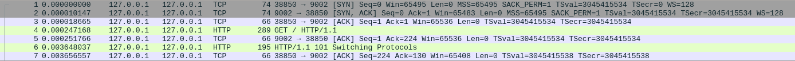
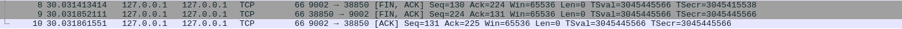

# WebSocket基本原理

结合wireshark抓取的数据包理解。先启动本地WebSocket服务端（port:9002）。

抓包接口: Loopback:io 
抓包过滤器：port 9002
显示过滤器：暂不设置


## WebSocket 与 HTTP、TCP

HTTP是请求-响应模式的通信协议。

HTTP1.0 每个请求都需要一个单独的连接。

HTTP1.1 引入可重用连接（长连接，Connection： keep-alive，默认开启）在一个TCP连接上可以传送多个HTTP请求和响应，减少了建立和关闭连接的消耗和延迟（其他优化和本文关系不大，暂不赘述）。

HTTP是半双工通信，同一时刻数据只能单向流动，服务端无法主动建立连接发送数据。这种特点在某些实时场景（比如请求获取一个需要一定时间才能返回到结果；或者获取某个不定时发生的事件信息，如股价变动、天气变化、web网页游戏状态刷新等），就很难处理，HTTP有几种方式解决问题：轮询、长轮询、流化，但是没有很完美的解决方法。

> 轮询：隔一段时间请求一次看看有没有想要的数据；
>
> 长轮询：连接保持较长时间不关闭，等待直到服务端返回数据或者超时；
>
> 流化：客户端发送一个请求，服务器发送并维护一个持续更新和保持打开（可以是无限或者规定的时间段）的开放响应。每当服务器有需要交付给客户端的信息时，它就更新响应。由于服务器从不发出完成HTTP响应的请求，因此连接一直保持打开。

为解决HTTP上述实时通信问题，引入了WebSocket协议，是全双工、双向、单套接字的连接，也是基于TCP的协议。

WebSocket相较于HTTP是单连接的，可以节约带宽、CPU资源、减少延迟、通信复杂度更低。

> 更多比较：WebRTC 、HTTP2.0。


## WebSocket 协议

### 连接握手

测试是用的Postman发起连接的`ws://127.0.0.1:9002`，客户端编码实现参考各WebSocket实现包的接口API文档。



**前3行**：TCP 3 次握手；

**第4行**：客户端发起WebSocket连接握手(HTTP/1.1协议的请求)；

握手数据：

```properties
Hypertext Transfer Protocol
    GET / HTTP/1.1\r\n
    Sec-WebSocket-Version: 13\r\n
    Sec-WebSocket-Key: pNgZr2dChVwcNts30DxZiQ==\r\n
    Connection: Upgrade\r\n
    Upgrade: websocket\r\n
    Sec-WebSocket-Extensions: permessage-deflate; client_max_window_bits\r\n
    Host: 127.0.0.1:9002\r\n
```

> 握手请求选项
>
> Sec-WebSocket-Protocol （子协议选择）、Sec-WebSocket-Extensions （拓展列表）?
>
> Origin: WebSocket 客户端是Web浏览器时需要提供此字段，用于同源策略检查。

**第5行**：ACK消息，即对前一行消息的确认消息；

**第6行**：握手成功；

握手成功返回数据：

```properties
Hypertext Transfer Protocol
    HTTP/1.1 101 Switching Protocols\r\n		# 101 状态码
    upgrade: websocket\r\n
    connection: upgrade\r\n
    sec-websocket-accept: W3UNJiLyRMXlwQ2lsHe8hNFegRU=\r\n
```

**第7行**：前一行的确认消息。

#### 安全模型

WebSocket协议在web网页中应用时基于web浏览器的同源策略模型；非浏览器页面的客户端中使用时可以接受任意源数据。

#### URI规范

```
ws-URI = "ws:" "//" host [ ":" port ] path [ "?" query ]
wss-URI = "wss:" "//" host [ ":" port ] path [ "?" query ]
```

wss是指整合了TLS的WebSocket协议，默认的"ws"端口是80，而默认的"wss"端口是443。。

> WebSocket URI 的 path、query 都有什么用？项目中只在节点负载均衡的时候用过。

#### 状态码


### 数据传输

#### 数据帧

#### 消息收发


### 关闭连接

测试中当服务端30s没有收到消息就断开连接。



就只是TCP的四次挥手，这里是服务端触发的，和书上怎么有点不一样。


## 参考

协议官方RFC文档：[RFC6455](https://www.rfc-editor.org/rfc/rfc6455)

Github上的中文翻译文档：[WebSocket协议RFC文档](https://github.com/HJava/myBlog/tree/master/WebSocket%20%E5%8D%8F%E8%AE%AE%20RFC%20%E6%96%87%E6%A1%A3)

